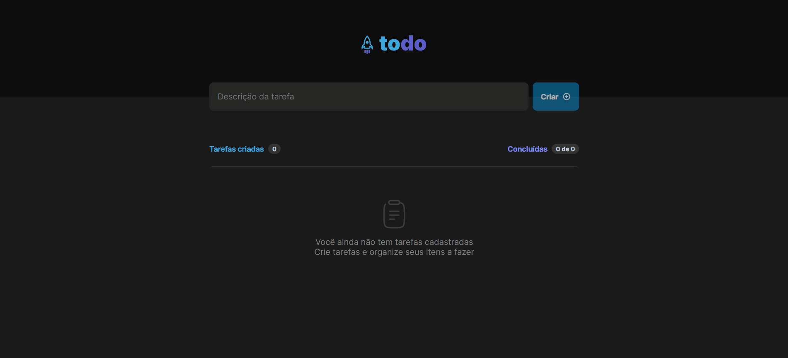

# To D List

<p align="center">
  <a href="#sobre">Sobre</a> -
  <a href="#tech">Tecnologias</a> -
  <a href="#pre">Pré Requisitos</a> -
  <a href="#func">Funcionalidades</a> -
  <a href="#autor">Autor</a>
</p>


<h1 id='sobre'>Sobre</h1>

Desafio técnico Rocketseat, criar um app de lista de tarefas usando
React-JS, o app tem que adicionar uma tarefa, marcar se a tarefa foi concluída,
excluir uma tarefa, contar o total de tarefas e mostrar quantas foram concluídas.

Template gerado com o vite, código em Typescript e estilização com Stitches CSS.

Visite o meu projeto clicando [AQUI](https://react-js-to-do-list-xi.vercel.app/)



<h1 id='tech'>Tecnologias</h1>

- React JS
- Typescript
- Stitches CSS
- Eslint
- Phosphor React (Lib de Ícones)
- UUID (Gerador UUID)


<h1 id='pre'>Pré requisitos </h1>

### Antes de rodar você precisar ter instalado na sua máquina as seguintes ferramentas:

1. Git
2. Node JS
3. Yarn

```bash
#Clone esse repositório
$ git clone https://github.com/joaofreitas91/react-js-to-do-list.git

#Entre na pasta
$ cd react-js-feed-app

#Instale as dependências 
$ yarn

#Execute a aplicação em modo de desenvolvimento
$ yarn run dev

#Se você não estiver com nenhum projeto rodando no momento, 
#o servidor irá iniciar na porta 3000 - acesse http://localhost:3000

```
<h1 id='func'>Funcionalidades</h1>

Nessa lista de tarefas você pode adicionar uma tarefa colocando uma 
descrição no input e apertando a tecla enter ou clicando no botão Criar.

Só é possível criar uma nova tarefa após começar a escrever.

Para marcar uma tarefa como concluída bastar clicar no checkbox e a tarefa
irá ficar riscada mostrando que a mesma está com status concluída.

Na parte superior da lista você pode verificar quantas tarefas foram criadas
e quantas dessas tarefas foram concluídas.

Cada tarefa tem um botão com com um simbolo de uma lixeira caso queira excluir
uma tarefa.

E você pode atualizar a vontade porque todas as ações ficam salvas no local storage.

<h1 id='autor'>Autor</h1>

## Olá, 👋

Feito com 💜 por João Paulo 👋 [Visite meu Linkedin](https://www.linkedin.com/in/joaopfreitas91/)
